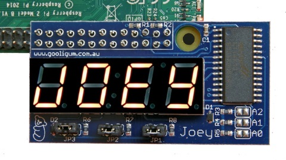
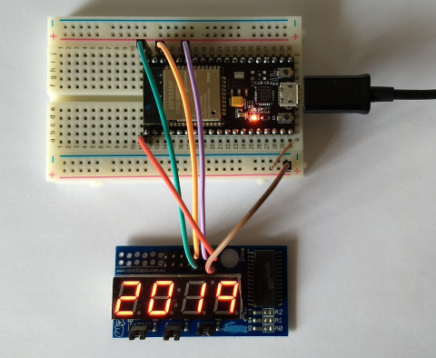
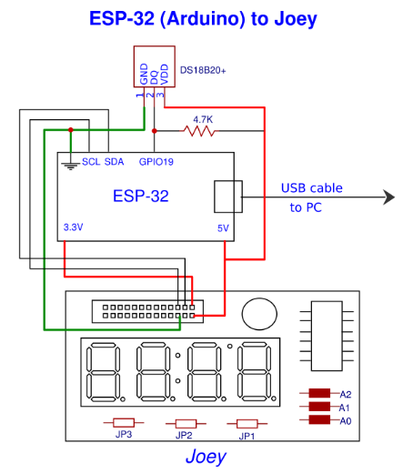
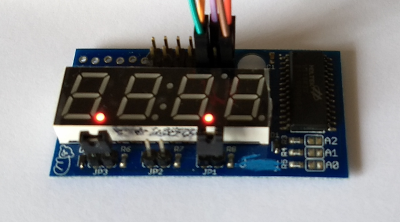

# Arduino support for Joey 4-digit LED display.

The Joey board from [Gooligum Electronics](http://www.gooligum.com.au) is a nifty 4-digit LED display that is designed to press-fit onto
the first 26 pins of a Raspberry Pi. The holes on the PCB are slightly offset from a standard 2.54mm grid so that the pin-to-hole friction maintains the contact. Besides LEDs, there are 3 pairs of male headers which can be used for switch input. A Holtek HT16K33 controller handles all the 7 segment interfacing requirements. See this 
[Kickstarter page](https://www.kickstarter.com/projects/gooligumelec/joey-a-sidecar-led-display-for-raspberry-pi) for background information.

Python code support is available from their [github site](https://github.com/gooligumelec/Joey-support-Python-code) and I have added some C code here for Arduino. For this project, an ESP-32 was connected to Joey but the code should work on any microcontroller supported by the Arduino framework eg ATmega328, STM32, etc.

Note: Adafruit LED Backpack library which also supports the Holtek HT16K33 chip does not play well with this board. The library uses 8 contiguous bits in the display buffer for each digit whereas Joey uses 16 bits to map the segments. As a result, the sevenseg test program show digits with missing segments.

## Wiring diagram
  

### Pin Connections
|Joey Pin|Name |
|-------|-----|
|1      |3.3V |
|2      |5V   |
|3      |SDA  |
|4      |     |
|5      |SCL  |
|6      |GND  |

## Software
Standalone test programs are found in the Examples directory. I will create a proper class library in future.

1. **[RandomNumbers.ino](https://github.com/alw1746/Adafruit_ILI9486_STM32/blob/master/examples/graphicstest/graphicstest.ino)** - Display 4 random digits with some fancy effects.  

2. **[ShowAll.ino](https://github.com/alw1746/Arduino-Joey/blob/master/examples/ShowAll/ShowAll.ino)** - Light up every segment on the Joey board in a loop and show corresponding pin-to-segment mappings in the serial monitor. Very useful debug tool.  

3. **[ReadKeys.ino](https://github.com/alw1746/Arduino-Joey/blob/master/examples/ReadKeys/ReadKeys.ino)** - Read the state of the jumpers (JP1-JP3) and light up a dot. The jumpers can be used to connect to switches, pushbuttons, etc.  

